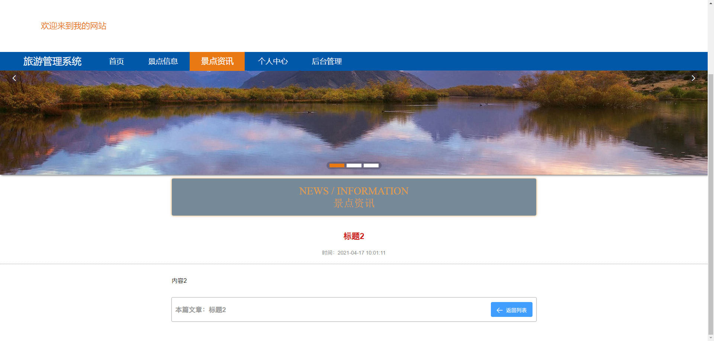

# 基于Springboot的旅游管理系统

## Springboot-0052


## 技术栈

Springboot mybatisplus vue mysql maven


## 数据库表(9张)


## 功能介绍

```properties
管理员登录后可对系统进行全面管理，确保系统正常稳定运行，管理员主要功能包括个人中心、用户管理、景点信息管理、订票信息管理、用户评价管理以及系统管理。

用户进入系统可查看系统信息，包括网站首页、景点信息、景点资讯等，注册登录后主要功能模块包括订票、个人中心、订票信息管理以及用户评价管理。
```


## 图片

### 前台





### 后台


## 访问路径

### 前台

```properties
http://localhost:8080/springbootul0e4/front/pages/login/login.html

账号 xiongwei
密码 123
```

### 后台

```properties
http://localhost:8080/springbootul0e4/admin/dist/index.html#/login

账号 abo
密码 abo
```


## 功能图


## 文档目录


## 打赏或交流


